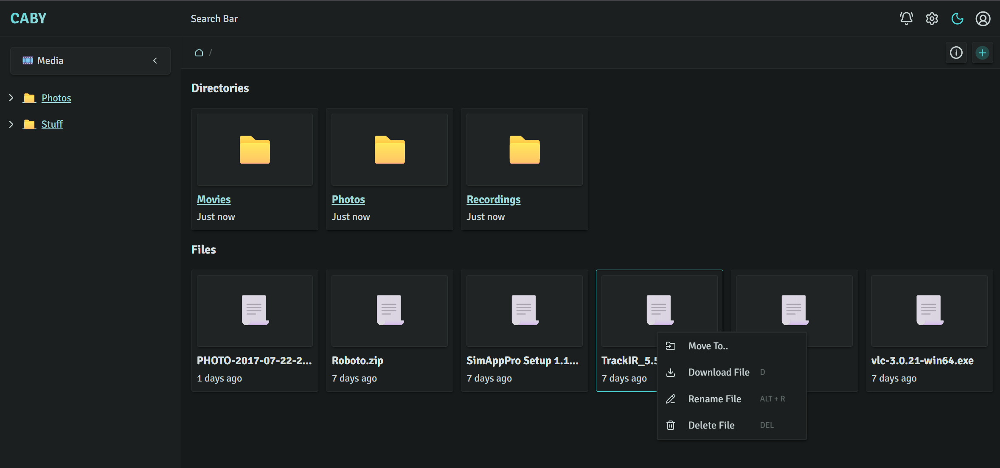

 

  <strong>⚠️ Note: Caby is in active development and in a pre-release state</strong>
  <picture>
    <source srcset=".github/assets/logo-white.png" media="(prefers-color-scheme: dark)">
    
  </picture>

  <em><ins>Simple and reliable</ins> self-hosted file management for your home network.</em>

  

## ✨ Features

- Requires **no backing services**. Everything is managed by the backend runtime.
- Files all the way down: Everything from configuration to metadata is stored in readable files.
- Organize your files within **spaces** for compartmentalization and easy access control
- Files are uploaded using **chunked uploads** for resumability, performance, and compatibility with certain ingress providers.
- Supports ARM images for Raspberry Pi and other lightweight devices.

## 📖 Documentation

Caby's documentation and install instructions can be found at [caby.io/docs](https://caby.io/docs).
