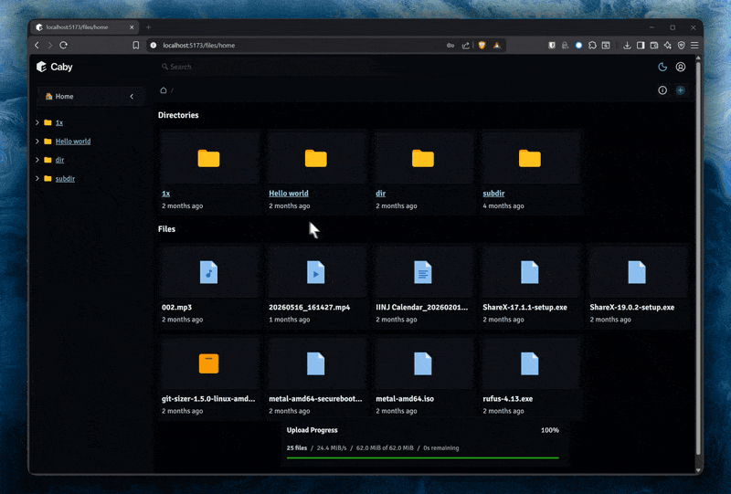

<p align="center">
  ⚠️ Note: Caby is in active development and in a pre-release state ⚠️
</p>

<br />

<p align="center">
  <picture>
    <source srcset=".github/assets/logo-white.png" media="(prefers-color-scheme: dark)">
    
  </picture>
</p>

<p align="center">
  <em><ins>Simple and reliable</ins> self-hosted file management for your home network.</em>
</p>

<p align="center">
  <a href="https://discord.gg/Z2JkSs2Hzy"></a>
</p>

<p align="center">
  
</p>

## ✨ Features

- Requires **no backing services**. Everything is managed by the backend runtime.
- Files all the way down: Everything from configuration to metadata is stored in readable files.
- Integrate with your favorite **OIDC** provider: Authentik, Pocket ID, Authelia, etc. Or, use the
  built-in password auth.
- Organize your files within **spaces** for compartmentalization and easy access control
- Files are uploaded using **chunked uploads** for resumability, performance, and compatibility with
  certain ingress providers.
- Share files, photos, and videos with family or guests using **shares**.
- Supports ARM images for Raspberry Pi and other lightweight devices.

## 🗺️ Roadmap

What we're working towards in the near future:

- [ ] File shares _(in progress)_
  - [x] File shares MVP
  - [ ] Guest uploads, writes, and deletes
- [ ] Background tasks (download files, convert videos, and more) _(in progress)_
  - [x] Background jobs system
  - [ ] Websocket events
  - [ ] Background downloads
- [ ] Web file editor
- [ ] File versioning
- [ ] Fine-grained user access
- [ ] Device syncing

Are we missing something? Let us know on [Discord](https://discord.gg/Z2JkSs2Hzy) or
[open an issue](https://github.com/caby-io/caby/issues).

## 🚀 Quick Start

For more complete installation and configuration information please refer to
[Caby's documentation](https://caby.io/getting-started/).

### Docker Compose

Grab the starter `compose.yaml` and `config.yaml`:

```bash
curl -O https://raw.githubusercontent.com/caby-io/caby/main/docker/compose.yaml
curl -O https://raw.githubusercontent.com/caby-io/caby/main/docker/config.yaml
```

Certain configuration items in Caby are set statically in a file so we'll need to prepare their
values ahead of deployment:

- Your username, and
- Your activation token

The activation token must be exactly 64 characters long. We can generate one with:

```bash
openssl rand -hex 32
```

Now open up the config file and edit the username and activation token to match:

```yaml
users:
  - name: <your cool username>
    activation_token: <a 64 character token>
```

Save the config file and deploy:

```bash
docker compose up -d
```

Navigate to the activation page to set your password (e.g. http://localhost:3000/activate) and
login.

For raw `docker run`, reverse-proxy setup, and full configuration options, see the
[Docker installation guide](https://caby.io/installation/docker/).
