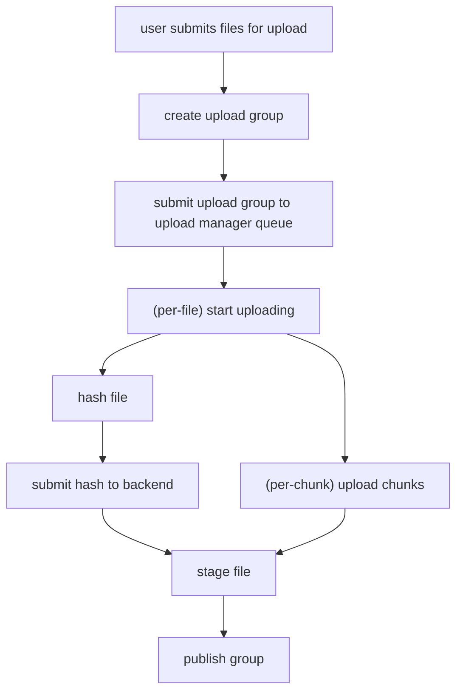

# Files response

```json
{
  "name": "Name of the entry",
  "path": "relative/path/of/entry",
  ...
}
```

# Dir structure

```
/app/cabynet
  ├── /oidc
  ├── /users
  ├── /spaces
    ├── /user
      ├── /live
      ├── /meta
      ├── /shares
      └── /uploads
    └── /media
      ├── /live
      ├── /meta
      ├── /shares
      └── /uploads
  ├── .secrets
  └── config.yaml
```

## User dir contents

```
/app/cabynet/users
  ├── /first_user
    ├── password      # user's salted & hashed p/w
    ├── profile.yaml  # user's profile, config, & preferences info
    ├── session_...   # an active user session
    └── ...more
```

# Request Paths

/list/{space}/

# Configs

```yaml
# config.yaml
---
# registration_enabled: false

# paths:
#   users_path: "users"
#   spaces_path: "spaces"
web:
  domain: "" # todo for CORS

auth:
  passwords:
    enabled: true
  # oidc using discovery
  oidc:
    issuer_url: "auth.oidc.com"
  # oidc manual
  oidc:
    issuer_url: "auth.oidc.com",
    authorization_endpoint: "",
    token_endpoint: "",
    jwks_uri: "",
    userinfo_endpoint: "" # optional

spaces:
  - name: home
    archetype: users
    path: /some/other/path # optional override
    readonly: false
  - name: media

roles:
  - name: admin
    global_permissions: "*"
  - name: family
    spaces:
      - name: home
        permissions: # todo
          - "rw:/"

users:
  - name: caby_guy
    email: caby_guy@caby.io
    activation_token: OHQFhErYIM7xK8gMtf9emXt4LssVp5ibBs3MgJXTBQXbw8Cs4HUyWv1HdXjJyUL5
    spaces:
      - name: home
        permissions: "*"
```

# Upload Management



- Should we commit files or groups?
- Tokens should definitely be per group in case we're uploading tons of small files

- todo: create meta ghosts
- todo: encode in upload token

# OIDC providers

| Provider             | `sub` format                         | `name` claim                                 |
| -------------------- | ------------------------------------ | -------------------------------------------- |
| Keycloak             | UUID v4 (`f5dab0e0-…`)               | yes (concat of first+last, if set)           |
| Authentik            | UUID v4                              | yes (full name field)                        |
| Authelia             | UUID v4                              | yes (`display_name` field)                   |
| Pocket-ID            | UUID v4                              | optional (user may not set it)               |
| Google _(reference)_ | numeric (`110248495921238986420`)    | yes (full name)                              |
| Auth0 _(reference)_  | `connection\|id` (e.g. `auth0\|abc`) | yes (often present; social connections vary) |

# Video preview transcode

## Video TODOs

Should probably do this after task/queue system is done

- stop playing video when closing preview
- add preview configuration
- show thumbnail for video
- show preview thumbnail in preview mode so the resolution change isn't jarring

Benchmarked on i9-10900K (10c/20t), software x264 only (no GPU). Sources: 4K HEVC @ 50 Mbps (iPhone-style) and 1080p H.264 @ 18 Mbps (Android-style), both with added grain so they're hard to compress (conservative). `s/min` = CPU-seconds per minute of source.

| Source → target                          | Speed    | CPU/min | Bitrate    | Storage    |
| ---------------------------------------- | -------- | ------- | ---------- | ---------- |
| iPhone 4K HEVC → 720p H.264 (veryfast)   | 3.1× RT  | ~19 s   | ~770 kbps  | ~6 MB/min  |
| iPhone 4K HEVC → 720p H.264 (medium)     | 3.2× RT  | ~19 s   | ~900 kbps  | ~7 MB/min  |
| iPhone 4K HEVC → 1080p H.264 (veryfast)  | 3.1× RT  | ~19 s   | ~1950 kbps | ~15 MB/min |
| iPhone 4K HEVC → 1080p H.264 (medium)    | 2.5× RT  | ~24 s   | ~2470 kbps | ~18 MB/min |
| Android 1080p H.264 → 720p H.264 (vfast) | 10.8× RT | ~6 s    | ~1570 kbps | ~12 MB/min |
| 1080p → 720p VP9 (cpu-used 4)            | 1.6× RT  | ~37 s   | ~2230 kbps | ~17 MB/min |
| 1080p → 720p AV1 (svt preset 8)          | 3.3× RT  | ~18 s   | ~1140 kbps | ~9 MB/min  |

- 4K cases are decode-bound (~3× RT regardless of output res — HEVC 4K decode dominates).
- Only transcode inputs that aren't already browser-playable (HEVC/HDR) — H.264/VP9 already stream via ServeFile.
- Weak home servers ~3-10× slower software-only; hw accel (QSV/VAAPI/NVENC) ~5-30× RT — biggest lever.
- todo: not lazy-in-handler like thumbs (occupies cores for minutes) — needs job queue + concurrency cap.

# Misc

```
rustup toolchain install nightly --allow-downgrade -c rustfmt
```
